# RAG Conversational Engine - System Architecture

## Executive Summary

The RAG Conversational Engine implements a **hierarchical multi-agent orchestration architecture** designed to handle complex queries requiring intelligent routing across multiple specialized domains (employee data, weather, news). EIRA serves as a central orchestrator that classifies user intent and delegates to specialized agents, enabling modular, scalable, and maintainable query processing.

---

## Architecture Diagram

```mermaid
graph TB
    subgraph "User & Security Boundary"
        User["👤 User (Web Browser)"]
    end

    subgraph "Application Layer - Trust Boundary 1: Internal Agents (Trusted)"
        EIRA["🧠 EIRA<br/>(Orchestrator Agent)<br/>- Intent Classification<br/>- Response Synthesis<br/>- HITL Gating"]
        
        VEGA["📊 VEGA<br/>(SQL Specialist)<br/>- Employee Queries<br/>- Department/Location"]
        
        NOVA["📰 NOVA<br/>(RAG Specialist)<br/>- Weather Search<br/>- News Retrieval"]
        
        KIRA["🗺️ KIRA<br/>(Location Resolver)<br/>- City Normalization<br/>- Semantic Matching"]
        
        AXIOM["✅ AXIOM<br/>(Query Validator)<br/>- SQL Validation<br/>- Security Checks"]
        
        SENTINEL["🛡️ SENTINEL<br/>(Groundedness Check)<br/>- Confidence Scoring<br/>- Fact Validation"]
        
        IRIS["🌾 IRIS<br/>(Data Ingestion)<br/>- Tavily Integration<br/>- Embedding Generation<br/>- Vector Storage"]
    end

    subgraph "Data Layer - Trust Boundary 2: Internal Storage (Trusted)"
        EmployeeDB["🗄️ Employee Database<br/>(SQLite)<br/>- 500 Employees<br/>- Department/Location"]
        
        ChromaVS["🎯 Chroma Vector Store<br/>- Weather Embeddings<br/>- News Embeddings"]
        
        SessionDB["💾 Session Database<br/>- Run State<br/>- Agent Memory"]
    end

    subgraph "External APIs - Trust Boundary 3: External (Untrusted, Validated)"
        Anthropic["🤖 Anthropic Claude<br/>(LLM Provider)<br/>- Model: claude-3.5-sonnet<br/>- API: Encrypted TLS"]
        
        Tavily["🌐 Tavily API<br/>(Data Provider)<br/>- Weather Data<br/>- News Data<br/>- API: Encrypted TLS"]
    end

    subgraph "Frontend - Trust Boundary 1: User Interface (Semi-Trusted)"
        StreamlitUI["💻 Streamlit UI<br/>- Chat Interface<br/>- Query Input<br/>- Response Display"]
    end

    %% Data Flows
    User -->|"1. Query (Natural Language)"| StreamlitUI
    StreamlitUI -->|"2. Sanitized Input"| EIRA
    
    EIRA -->|"3a. Route: Employee?"| VEGA
    VEGA -->|"4a. SQL Query"| EmployeeDB
    EmployeeDB -->|"5a. Results"| VEGA
    VEGA -->|"6a. Structured Data"| EIRA
    
    EIRA -->|"3b. Route: Location?"| KIRA
    KIRA -->|"4b. Semantic Search"| NOVA
    
    EIRA -->|"3c. Route: Weather/News?"| NOVA
    NOVA -->|"4c. Chroma Query"| ChromaVS
    ChromaVS -->|"5c. Embeddings + Results"| NOVA
    NOVA -->|"6c. Context"| EIRA
    
    EIRA -->|"7. Validate Query"| AXIOM
    AXIOM -->|"8. Validation Result"| EIRA
    
    EIRA -->|"9. Format Response"| SENTINEL
    SENTINEL -->|"10. Confidence + Verdict"| EIRA
    
    EIRA -->|"11. Ingest Missing Data?"| IRIS
    IRIS -->|"12. Fetch"| Tavily
    Tavily -->|"13. Raw Data (JSON)"| IRIS
    IRIS -->|"14. Generate Embeddings"| IRIS
    IRIS -->|"15. Store Embeddings"| ChromaVS
    
    EIRA -->|"16. Call LLM (if needed)"| Anthropic
    Anthropic -->|"17. Response"| EIRA
    
    EIRA -->|"18. Final Response"| StreamlitUI
    StreamlitUI -->|"19. Display"| User
    
    EIRA -->|"Save Session"| SessionDB

    style User fill:#e1f5ff
    style StreamlitUI fill:#f3e5f5
    style EIRA fill:#fff3e0,stroke:#ff9800,stroke-width:3px
    style VEGA fill:#e8f5e9,stroke:#4caf50,stroke-width:2px
    style NOVA fill:#e8f5e9,stroke:#4caf50,stroke-width:2px
    style KIRA fill:#e8f5e9,stroke:#4caf50,stroke-width:2px
    style AXIOM fill:#e8f5e9,stroke:#4caf50,stroke-width:2px
    style SENTINEL fill:#e8f5e9,stroke:#4caf50,stroke-width:2px
    style IRIS fill:#e8f5e9,stroke:#4caf50,stroke-width:2px
    style EmployeeDB fill:#fce4ec,stroke:#e91e63,stroke-width:2px
    style ChromaVS fill:#fce4ec,stroke:#e91e63,stroke-width:2px
    style SessionDB fill:#fce4ec,stroke:#e91e63,stroke-width:2px
    style Anthropic fill:#ffebee,stroke:#f44336,stroke-width:2px
    style Tavily fill:#ffebee,stroke:#f44336,stroke-width:2px
```



### Trust Boundaries Explained

| Boundary | Type | Components | Trust Level | Validation |
|----------|------|-----------|------------|-----------|
| **TB1** | Internal Agents | EIRA, VEGA, NOVA, KIRA, AXIOM, SENTINEL, IRIS | ✅ High | Code review, static analysis |
| **TB2** | Internal Storage | Employee DB, Chroma, Session DB | ✅ High | SQLite integrity, checksums |
| **TB3** | External APIs | Anthropic Claude, Tavily | ⚠️ Medium | TLS encryption, rate limiting, input validation |
| **TB4** | User Input | Chat UI, Query strings | ❌ Low | Input sanitization, SQL injection prevention |

---

## Decomposition Pattern: Hierarchical Multi-Agent

### Pattern Structure

```
┌─────────────────────────────────────────┐
│ ORCHESTRATOR LAYER (EIRA)               │
│ - Intent Classification                 │
│ - Request Routing                       │
│ - Response Synthesis                    │
└────────────────┬────────────────────────┘
                 │
        ┌────────┼────────┬─────────┐
        │        │        │         │
┌───────▼──┐ ┌──▼────┐ ┌─▼──────┐ ┌▼──────┐
│ VEGA     │ │ NOVA  │ │ KIRA   │ │ IRIS  │
│ SQL      │ │ RAG   │ │ LOCATION
│          │ │ SEARCH│ │ RESOLVE│ │INGEST │
└──────────┘ └───────┘ └────────┘ └───────┘
        │        │        │         │
        └────────┼────────┴────────┐
                 │                 │
        ┌────────▼──────┐  ┌──────▼────┐
        │  Data Stores   │  │External   │
        │  (Trusted)     │  │APIs (Val) │
        └────────────────┘  └───────────┘
```

### Decomposition Justification

**Why Hierarchical?**
- **Single Point of Entry**: EIRA classifies all incoming queries, ensuring consistent handling
- **Specialization**: Each agent owns ONE domain (SQL, RAG, location, validation)
- **Separation of Concerns**: Agents don't need to know about each other's implementations
- **Error Isolation**: Failures in one specialist don't cascade to others

**Why Multi-Agent vs. Monolithic?**
- Employee queries require SQL expertise (VEGA specialization)
- Weather/news queries require semantic search (NOVA specialization)
- Location resolution needs embedding-based matching (KIRA specialization)
- Query validation needs security context (AXIOM specialization)
- A monolithic agent would require all expertise, creating cognitive overload for the LLM

---

## Component Descriptions

### Orchestration Layer

#### EIRA (Executive Intelligence Routing Agent)
- **Role**: Central orchestrator and decision-maker
- **Responsibilities**:
  - Classify user intent into categories: `employee_query | weather_query | news_query | meta | unclear`
  - Route requests to appropriate specialists
  - Synthesize responses from multiple agents
  - Apply HITL gates for high-stakes decisions
  - Generate final response with confidence scoring
- **Input**: Natural language query
- **Output**: Structured response with confidence and citations

### Specialist Agents

#### VEGA (SQL Specialist)
- **Role**: Employee database query executor
- **Responsibilities**:
  - Parse employee questions into SQL queries
  - Validate queries against schema
  - Execute safe queries on employee database
  - Return structured results
- **Data Source**: Employee DB (SQLite, 500 rows)
- **Safety**: Query validation via AXIOM

#### NOVA (RAG Specialist)
- **Role**: Weather and news retrieval
- **Responsibilities**:
  - Search vector embeddings for relevant context
  - Generate queries for Chroma vector store
  - Retrieve weather/news snippets
  - Return ranked results by relevance
- **Data Source**: Chroma vector store (weather_embeddings, news_embeddings)

#### KIRA (Location Resolver)
- **Role**: City normalization and semantic matching
- **Responsibilities**:
  - Resolve employee location from name
  - Normalize location names to canonical cities
  - Perform semantic city name matching
  - Return best matching canonical city
- **Data Source**: Employee DB + Embeddings
- **Canonical Cities**: 10 cities (Austin, Seattle, New York, Boston, Atlanta, Denver, Chicago, London, Miami, Toronto)

#### AXIOM (Query Validator)
- **Role**: Pre-execution validation
- **Responsibilities**:
  - Validate SQL query syntax
  - Check for injection attacks
  - Verify Chroma filter validity
  - Ensure queries won't cause harm
- **Output**: Pass/Fail verdict with reason

#### SENTINEL (Groundedness Validator)
- **Role**: Post-generation fact validation
- **Responsibilities**:
  - Score response groundedness (0.0-1.0)
  - Verify claims against sources
  - Flag hallucinations
  - Trigger HITL gate if confidence < 0.75
- **Threshold**: Confidence must be ≥ 0.75

#### IRIS (Data Ingestion Agent)
- **Role**: Weather and news ingestion pipeline
- **Responsibilities**:
  - Fetch data from Tavily API
  - Generate embeddings via sentence-transformers
  - Upsert embeddings into Chroma
  - Maintain freshness of data
- **Data Source**: Tavily API (weather, news)
- **Embedding Model**: `all-MiniLM-L6-v2` (384 dims, local, no API key)

### Data Layer

#### Employee Database (SQLite)
- **Schema**: `employees` table with 500 seeded rows
- **Columns**: `employee_id, name, age, department, office_location`
- **Constraints**: 
  - Age: 22-65 years
  - Location: Must be from CANONICAL_CITIES
  - Department: One of 8 departments
- **Indexes**: Name, location, department (for query performance)

#### Chroma Vector Store (Embedded)
- **Collections**:
  - `weather_embeddings`: Weather snapshots per city
  - `news_embeddings`: News articles by topic
- **Embedding Dimension**: 384 (all-MiniLM-L6-v2)
- **Distance Metric**: Cosine similarity
- **Persistence**: SQLite backend at `./data/chroma`

#### Session Database (SQLite + aiosqlite)
- **Purpose**: Store agent run state across conversations
- **Tables**: RunState, conversation history
- **Format**: Async SQLite for concurrent agent runs

### External APIs

#### Anthropic Claude (LLM)
- **Model**: `claude-3.5-sonnet-20241022`
- **Purpose**: General reasoning, response synthesis
- **Rate Limiting**: 60 RPM (Streamlit rate adapted)
- **Fallback**: None (no OpenAI dependency)

#### Tavily API
- **Purpose**: Real-time weather and news data
- **Data**: Current weather, recent news articles
- **Freshness**: ~6 hours (configurable via `WEATHER_FRESHNESS_HOURS`)
- **API Key**: Required in `.env` (`TAVILY_API_KEY`)

---

## Architecture Choices: Rationale & Alternatives

### Choice 1: Hierarchical Multi-Agent vs. Alternatives

#### ✅ CHOSEN: Hierarchical Multi-Agent

**Definition**: Single orchestrator (EIRA) delegates to specialized agents. Sequential routing: EIRA → specialist → result → EIRA.

**Advantages**:
- **Modularity**: Each agent can be updated independently
- **Testability**: Specialists can be tested in isolation
- **Safety**: AXIOM validates before execution, SENTINEL validates after
- **Scalability**: New agents can be added without modifying EIRA's routing logic
- **Interpretability**: Clear chain of responsibility; easy to debug

**Implementation**:
```
Query → EIRA (classify) → VEGA|NOVA|KIRA (execute) → EIRA (synthesize) → Response
```

---

#### ❌ REJECTED: Single Monolithic Chatbot

**Definition**: One LLM handles all queries directly without routing.

**Example Flow**:
```
Query → Claude (do everything) → Response
```

**Why Rejected**:
1. **Hallucination Risk**: LLM might confabulate employee data (no database grounding)
2. **Cost**: Long context windows needed for all domain knowledge
3. **Accuracy**: Generic LLM worse at SQL generation than specialized tool
4. **Control**: Can't validate queries before execution (no AXIOM step)
5. **Latency**: Single LLM call slower than routing to appropriate tool

**Trade-off**: Simpler architecture but higher error rates and cost.

---

#### ❌ REJECTED: Flat Multi-Agent (No Orchestration)

**Definition**: All agents run in parallel; return-first-complete or voting mechanism.

**Example Flow**:
```
Query → [VEGA, NOVA, KIRA] (parallel) → Merge results → Response
```

**Why Rejected**:
1. **Unnecessary Computation**: Runs agents that don't apply to the query
2. **Conflicting Answers**: Multiple agents might return different valid results
3. **Ambiguous Intent**: Without EIRA classification, unclear which result to trust
4. **Cost**: 6x LLM calls vs. 1x orchestration call
5. **Latency**: No speedup (sequential routing faster than waiting for slowest parallel agent)

**Trade-off**: Parallelism gains are offset by wasted computation and result ambiguity.

---

#### ❌ REJECTED: Simple Workflow (if-then rules)

**Definition**: Static routing based on keywords (e.g., "weather" → NOVA, "employee" → VEGA).

**Example Flow**:
```
if "weather" in query: → NOVA
elif "employee" in query: → VEGA
else: → Claude
```

**Why Rejected**:
1. **Rigidity**: Can't handle nuanced intent (e.g., "What's the weather for Alice in Finance?")
2. **Maintenance Burden**: New query types require new rules
3. **No Fallback**: Keyword misses fail silently
4. **Semantic Blindness**: Can't detect indirect references ("climate in Austin", "staff in NY")
5. **No Learning**: Rules don't adapt to user patterns

**Trade-off**: Fast implementation but brittle, unmaintainable, low coverage.

---

### Choice 2: Decomposition Pattern: Sequential Routing

#### ✅ CHOSEN: Sequential Routing

**Definition**: EIRA routes to ONE appropriate agent per query. Agents execute sequentially.

**Flow**:
```
1. EIRA classifies intent
2. EIRA routes to specialist(s)
3. Specialist(s) execute
4. EIRA synthesizes response
```

**Why Sequential?**
- **Clarity**: Each request has ONE clear path
- **Determinism**: Reproducible, not probabilistic
- **Safety**: Validation gates ensure quality before user sees response
- **Cost**: Minimal unnecessary computation

---

#### ❌ REJECTED: Parallel Agent Execution

**Definition**: Multiple agents run concurrently; results merged.

**Example**:
```
VEGA (3s) vs. NOVA (5s) → Merge both results
```

**Why Rejected**:
1. **Intent Ambiguity**: Query shouldn't need multiple specialists
2. **Result Merging**: No canonical way to combine results
3. **Latency**: Tail latency = slowest agent (5s), not speedup
4. **Cost**: Multiple API calls

**Appropriate If**: User explicitly requests cross-domain (rare). Then use hierarchical routing: EIRA decides to call both → synthesize.

---

### Choice 3: Trust Boundaries & Validation

#### ✅ CHOSEN: Layered Validation

**Layers**:
1. **Input Validation** (StreamlitUI): Sanitize user input
2. **Query Validation** (AXIOM): Pre-execution checks
3. **Response Validation** (SENTINEL): Post-generation checks
4. **HITL Gate**: Trigger if confidence < 0.75 or ambiguity detected

**Attacks Mitigated**:
- **SQL Injection**: AXIOM detects malicious SQL
- **Prompt Injection**: Separate context for instructions vs. user data
- **Data Exfiltration**: VEGA only returns authorized fields
- **Hallucination**: SENTINEL gates low-confidence responses

---

#### ❌ REJECTED: Trust External APIs Blindly

**Definition**: No validation; accept Tavily/Claude responses as-is.

**Why Rejected**:
- Tavily data could be stale or incorrect
- Claude could hallucinate
- No audit trail for compliance

---

### Choice 4: Embedding Strategy

#### ✅ CHOSEN: Local Sentence-Transformers

**Model**: `all-MiniLM-L6-v2` (384 dims)
- **No API key needed**: Runs on-device
- **Fast**: ~10ms inference
- **Size**: 33MB (acceptable footprint)

**Why**:
- **Cost**: $0 (no API calls)
- **Privacy**: Embeddings never leave local system
- **Latency**: Fast inference
- **Determinism**: Same input always produces same embedding

---

#### ❌ REJECTED: OpenAI text-embedding-3-small

**Cost**: ~$0.02 per 1M tokens (~5×sentence-transformers cost)
**Privacy**: Embeddings sent to OpenAI
**Latency**: Network round-trip
**Obsolescence Risk**: API deprecation

---

## Data Flow Walkthrough

### Scenario 1: Employee Query
```
User: "How many engineers are in New York?"

1. StreamlitUI sanitizes input
2. EIRA receives: "How many engineers are in New York?"
3. EIRA classifies: intent=employee_query, domain=SQL
4. EIRA calls AXIOM: validate_query("SELECT... WHERE department='Engineering' AND office_location='New York, NY'")
5. AXIOM returns: valid=True
6. EIRA calls VEGA: execute_query(...)
7. VEGA queries EmployeeDB: 20 results
8. EIRA calls SENTINEL: validate_response("There are 20 engineers in New York, NY.")
9. SENTINEL returns: confidence=0.95 (data-backed, no hallucination risk)
10. EIRA returns response + citations to StreamlitUI
11. User sees: "There are 20 engineers in New York, NY. [Employee Database]"
```

**Latency**: ~500ms (1 LLM call for classification + 1 DB query)

---

### Scenario 2: Weather Query
```
User: "What is the weather for Lisa Hensley?"

1. StreamlitUI sanitizes input
2. EIRA receives: "What is the weather for Lisa Hensley?"
3. EIRA classifies: intent=weather_query, domain=RAG
4. EIRA calls KIRA: resolve_location("Lisa Hensley")
5. KIRA queries EmployeeDB + embeddings: returns "London, UK"
6. EIRA calls NOVA: search_weather("London, UK")
7. NOVA queries ChromaVS: returns [weather_snippet_1, weather_snippet_2, ...]
8. NOVA synthesizes: "Partly cloudy, 63.3°F, Humidity 68%, Wind 5.6 mph"
9. EIRA calls SENTINEL: validate_response(...)
10. SENTINEL returns: confidence=0.85 (Tavily data, ~6h old but recent)
11. EIRA returns response + citations to StreamlitUI
12. User sees: "Weather in London, UK: Partly cloudy, 63.3°F... [Tavily]"
```

**Latency**: ~1.2s (multiple steps, Chroma query)

---

### Scenario 3: Ambiguous Query
```
User: "Tell me about Austin"

1. EIRA classifies: intent=ambiguous (could be employee_query OR weather_query)
2. EIRA triggers HITL gate: "What would you like to know about Austin? (1) Employees (2) Weather"
3. User responds: "Employees"
4. EIRA re-routes to VEGA with clarified intent
5. Continue as Scenario 1...
```

**HITL Benefit**: Avoids guessing and returns wrong answer.

---

## Deployment & Scaling

### Current Deployment (Phase 6)
- **Single VM**: SQLite, Chroma, Streamlit UI all co-located
- **Concurrency**: Single user (Streamlit built-in session isolation)
- **Latency**: <2s per query

### Future Scaling Options

#### Option A: Horizontal Multi-User
- Extract Chroma to standalone service
- Extract employee DB to PostgreSQL
- Deploy EIRA as API service
- Streamlit UI → API backend
- **Communication**: HTTP/REST (add 100-200ms latency)

#### Option B: Multi-Instance Orchestration
- Run 3× EIRA instances behind load balancer
- Shared data layer (Postgres, Chroma cluster)
- Session affinity for conversation continuity
- **Benefit**: 3× throughput, 99.9% uptime

---

## Security Considerations

### Trust Matrix

| Component | Trustworthiness | Validation |
|-----------|---|---|
| EmployeeDB | ✅ High (internal, immutable at runtime) | N/A |
| Chroma | ✅ High (local, controlled ingestion) | N/A |
| EIRA, VEGA, NOVA, etc. | ✅ High (code-reviewed, deterministic) | Static analysis |
| Anthropic Claude | ⚠️ Medium (hallucination risk) | SENTINEL confidence check |
| Tavily API | ⚠️ Medium (external, could be stale/wrong) | Cache invalidation, user disclaimer |
| User Input | ❌ Low (untrusted) | Sanitization, intent classification |

### Attack Surface & Mitigations

1. **SQL Injection** (User → VEGA)
   - **Mitigation**: AXIOM pre-validates SQL syntax + parameterized queries
   
2. **Prompt Injection** (User → EIRA)
   - **Mitigation**: Separate instruction prompts from user data, content-based filtering in StreamlitUI
   
3. **Data Exfiltration** (VEGA → EmployeeDB)
   - **Mitigation**: VEGA only returns fields in whitelist (name, department, location, age)
   
4. **Denial of Service** (User → EIRA)
   - **Mitigation**: Streamlit rate limiting (1 query every 2s), query timeout (30s)
   
5. **Stale Weather Data** (Tavily → User)
   - **Mitigation**: Cache invalidation every 6h, user disclaimer ("data is ~6h old")

---

## Conclusion

The **Hierarchical Multi-Agent** architecture with **Sequential Decomposition** is optimal for this use case because:

1. **Modularity**: Specialists own well-defined domains
2. **Safety**: Multiple validation layers (AXIOM, SENTINEL, HITL)
3. **Maintainability**: New data sources can be added without touching EIRA
4. **Cost**: Minimal API calls; local embeddings
5. **Interpretability**: Clear chain of responsibility for debugging
6. **Scalability**: Can migrate to microservices without architecture changes

**Against Alternatives**:
- ✅ vs. Monolithic: Prevents hallucination, reduces cost, improves accuracy
- ✅ vs. Flat Multi-Agent: Reduces unnecessary computation, clarifies intent
- ✅ vs. Workflow Rules: Handles nuance, adapts to new patterns
- ✅ vs. Parallel Execution: Minimal tail latency, deterministic results

This architecture embodies **separation of concerns**, **fail-safe defaults**, and **defense in depth** — industry best practices for conversational AI systems.
