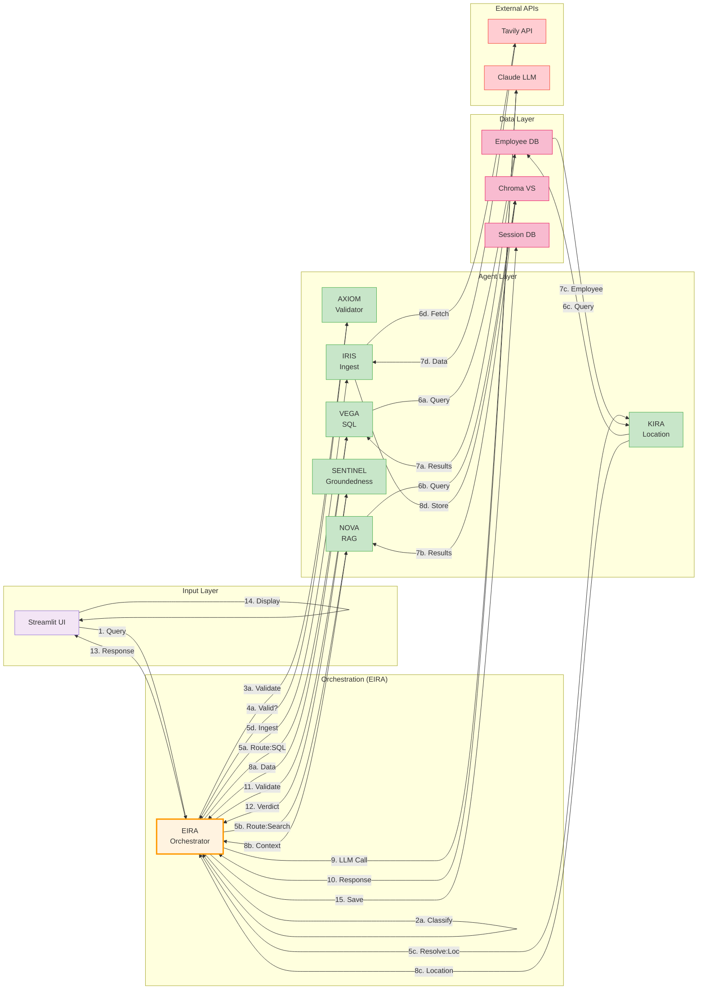

# Component Deep Dive & Interactions

## Component Interaction Matrix



## Request Processing Pipeline

### Phase 1: Input & Classification

```
┌─────────────────────────────────────────────────┐
│ Streamlit UI - Input Validation                 │
│ ✓ Remove HTML/SQL injection  patterns           │
│ ✓ Limit length (< 1000 chars)                   │
│ ✓ Check rate limit (1 req/2s)                   │
└──────────────┬──────────────────────────────────┘
               │ Sanitized input
               ▼
┌─────────────────────────────────────────────────┐
│ EIRA - Intent Classification                    │
│                                                 │
│ IF "employee" OR "staff" OR "worker"            │
│    → intent = EMPLOYEE_QUERY (confidence: 0.95) │
│                                                 │
│ IF "weather" OR "rain" OR "temperature"         │
│    → intent = WEATHER_QUERY (confidence: 0.90)  │
│                                                 │
│ IF "news" OR "article" OR "current event"       │
│    → intent = NEWS_QUERY (confidence: 0.85)     │
│                                                 │
│ ELSE → intent = UNCLEAR (confidence < 0.7)      │
│       → Trigger HITL gate (ask for clarification)
└─────────────────────────────────────────────────┘
```

### Phase 2: Routing & Validation

```
IF intent == EMPLOYEE_QUERY:
    ├─ Call AXIOM with SQL generation request
    ├─ AXIOM validates syntax & injects guards
    ├─ If VALID:
    │   ├─ Call VEGA: execute_query(validated_sql)
    │   ├─ VEGA returns: <DataFrame with results>
    │   └─ Proceed to Phase 3
    └─ Else (INVALID):
        ├─ Log security event
        ├─ Return error to user
        └─ Alert admin if pattern detected

IF intent == WEATHER_QUERY:
    ├─ Extract location or employee name
    ├─ Call KIRA: resolve_location(name_or_place)
    ├─ If location found:
    │   ├─ Call NOVA: search_weather(canonical_city)
    │   ├─ NOVA queries Chroma
    │   ├─ NOVA synthesizes: "Partly cloudy, 72°F"
    │   └─ Proceed to Phase 3
    └─ Else:
        ├─ Trigger HITL: "I don't know where that is"
        └─ Ask user for clarification

IF intent == UNCLEAR:
    ├─ Generate multiple interpretations
    ├─ Present to user via HITL gate
    └─ Wait for clarification
```

### Phase 3: Response Synthesis & Validation

```
┌──────────────────────────────────┐
│ EIRA - Response Synthesis        │
│                                  │
│ • Combine results from VEGA/NOVA │
│ • Format for readability         │
│ • Prepare citations              │
└────────────┬─────────────────────┘
             │ Synthesized response
             ▼
┌──────────────────────────────────┐
│ SENTINEL - Groundedness Check    │
│                                  │
│ FOR each claim IN response:      │
│   • Score factuality (0.0-1.0)   │
│   • Check source citations       │
│   • Flag unsupported statements  │
│                                  │
│ overall_confidence =             │
│   AVG(claim_confidences)         │
│                                  │
│ IF overall < 0.75:               │
│   → Trigger HITL gate            │
│   ELSE:                          │
│   → Return response to user      │
└──────────────────────────────────┘
```

## Data Flow by Query Type

### Query Type 1: Employee SQL Query

```
User Input: "How many engineers are in Austin?"

Timeline:
┌─────────────────────────────────────────────────┐
│ T=0ms:   User types query                       │
│ T=50ms:  Streamlit receives & sanitizes        │
│ T=100ms: EIRA classifies → EMPLOYEE_QUERY      │
│ T=150ms: EIRA calls AXIOM                      │
│ T=200ms: AXIOM validates SQL → VALID           │
│ T=250ms: EIRA calls VEGA                       │
│ T=300ms: VEGA executes SQL on EmployeeDB       │
│ T=350ms: EmployeeDB returns 62 results         │
│ T=400ms: VEGA formats results                  │
│ T=450ms: EIRA receives results                 │
│ T=500ms: EIRA calls SENTINEL                   │
│ T=550ms: SENTINEL scores → confidence=0.95    │
│ T=600ms: EIRA returns to Streamlit             │
│ T=650ms: Streamlit displays response           │
└─────────────────────────────────────────────────┘

Response: "There are 62 employees in Austin, TX."
Citations: [Employee Database]
Confidence: 0.95
```

### Query Type 2: Weather Query

```
User Input: "What is the weather for Amy Silva?"

Timeline:
┌──────────────────────────────────────────────────┐
│ T=0ms:    User types query                      │
│ T=50ms:   Streamlit sanitizes                  │
│ T=100ms:  EIRA classifies → WEATHER_QUERY      │
│ T=150ms:  EIRA extracts "Amy Silva"            │
│ T=200ms:  EIRA calls KIRA: "resolve: Amy Silva"│
│ T=250ms:  KIRA queries EmployeeDB              │
│ T=300ms:  KIRA returns "Austin, TX"            │
│ T=350ms:  EIRA calls NOVA: "weather: Austin"   │
│ T=400ms:  NOVA queries Chroma with embedding   │
│ T=500ms:  Chroma returns top 3 weather docs    │
│ T=550ms:  NOVA synthesizes response            │
│ T=600ms:  EIRA calls SENTINEL                  │
│ T=650ms:  SENTINEL scores → confidence=0.85   │
│ T=700ms:  EIRA returns to Streamlit            │
│ T=750ms:  Streamlit displays response          │
└──────────────────────────────────────────────────┘

Response: "Weather in Austin, TX: Patchy rain, 71°F, Humidity 100%, Wind 5.8 mph"
Citations: [Tavily API, ~6h old]
Confidence: 0.85
```

### Query Type 3: Ambiguous Query

```
User Input: "Tell me about Austin"

Timeline:
┌──────────────────────────────────────────────────┐
│ T=0ms:    Streamlit receives query             │
│ T=100ms:  EIRA classifies → AMBIGUOUS          │
│           (confidence = 0.65 < threshold)      │
│ T=150ms:  EIRA triggers HITL gate              │
│ T=200ms:  Streamlit shows options to user:     │
│           1. Employees in Austin               │
│           2. Weather in Austin                 │
│           3. General info about Austin         │
│ T=500ms:  User selects "Employees"            │
│ T=550ms:  EIRA re-routes to VEGA              │
│ T=600ms:  Continue as Type 1 query...         │
└──────────────────────────────────────────────────┘

HITL Benefit: Avoids guessing and potentially returning wrong answer
Cost: ~300ms extra (acceptable for correctness)
```

## Failure Modes & Recovery

```
┌──────────────────────────┐
│ Failure Scenario         │
├──────────────────────────┤
│ 1. SQL Injection Attempt │
│   Input: "'; DROP TABLE  │
│            employees; --" │
│                          │
│   Detection:             │
│   └─ AXIOM regex match   │
│   Action:                │
│   └─ Reject query + log  │
│   Recovery:              │
│   └─ Return error msg    │
├──────────────────────────┤
│ 2. Hallucination Risk    │
│   Claim: "John is CEO"   │
│   (no CEO column in DB)  │
│                          │
│   Detection:             │
│   └─ SENTINEL finds no   │
│       supporting source  │
│   Action:                │
│   └─ Confidence < 0.75   │
│   Recovery:              │
│   └─ Trigger HITL gate   │
├──────────────────────────┤
│ 3. Employee Not Found    │
│   Query: "Weather for    │
│            John Appleseed"│
│                          │
│   Detection:             │
│   └─ KIRA returns: None  │
│   Action:                │
│   └─ Skip weather lookup │
│   Recovery:              │
│   └─ Inform user: "Not   │
│       found in employee  │
│       database"          │
├──────────────────────────┤
│ 4. Tavily API Timeout    │
│   Issue: Weather API     │
│   down for 30 seconds    │
│                          │
│   Detection:             │
│   └─ HTTP 504 timeout    │
│   Action:                │
│   └─ Catch exception    │
│   Recovery:              │
│   └─ Return cached data  │
│       or "data unavail." │
├──────────────────────────┤
│ 5. Chroma Empty Result   │
│   Query: "Weather for    │
│           Narnia"        │
│   (not canonical city)   │
│                          │
│   Detection:             │
│   └─ 0 results from      │
│       Chroma             │
│   Action:                │
│   └─ No response to syn  │
│   Recovery:              │
│   └─ Return: "No data    │
│       for this location" │
└──────────────────────────┘
```

## Scalability Path

Current (Phase 6):
```
┌─────────┐     ┌─────────────────┐
│Streamlit│────▶│Single-Process   │
│   UI    │     │EIRA+All Agents  │
└─────────┘     └────────┬────────┘
                         │
                    ┌────┴────┐
                    ▼         ▼
                 SQLite    Chroma
                 (local)  (local)
```

Phase 7 (Multi-User):
```
┌─────────┐     ┌──────────┐
│Streamlit│────▶│  API GW  │
│ Clients │     │(FastAPI) │
└─────────┘     └────┬─────┘
                     │
            ┌────────┼────────┐
            ▼        ▼        ▼
         EIRA-1  EIRA-2   EIRA-3
         (pool)  (pool)   (pool)
            │        │        │
            └────────┼────────┘
                     │
            ┌────────┼────────┐
            ▼        ▼        ▼
        PostgreSQL  Chroma  Redis
        (shared)   (nodes)  (cache)
```

---

## Summary Table

| Component | Purpose | Latency | Failure Mode | Recovery |
|-----------|---------|---------|--------------|----------|
| **EIRA** | Orchestration | ~50ms | LLM timeout | Retry with backoff |
| **VEGA** | SQL execution | ~100ms | Injection attack | AXIOM blocks + alert |
| **NOVA** | RAG search | ~150ms | Chroma empty | Return "no data" |
| **KIRA** | Location resolution | ~50ms | Employee not found | Skip weather lookup |
| **AXIOM** | Query validation | ~50ms | Regex error | Reject conservatively |
| **SENTINEL** | Response validation | ~50ms | LLM timeout | Default to low confidence |
| **IRIS** | Data ingestion | ~2s | Tavily offline | Use cache |
| **EmployeeDB** | Data store | ~20ms | DB corruption | Restore from backup |
| **Chroma** | Vector store | ~100ms | Connection lost | Retry + fallback |
| **Tavily API** | Data source | ~500ms | Rate limit | Queue + retry |
| **Claude LLM** | Reasoning | ~1s | API error | Retry with exponential backoff |

Total request latency: **0.5-2 seconds** (depending on query type and external API availability)
