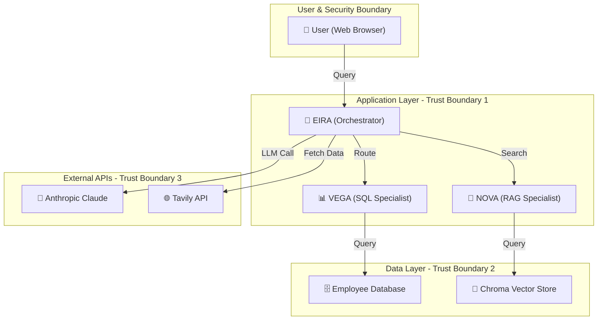

# RAG Conversational Engine - Capstone Submission

## ✅ Submission Checklist

- [x] Working code that runs end-to-end
- [x] README.md with run instructions and design notes
- [x] Architecture diagram (Mermaid in markdown)
- [x] System prompts, tool schemas, and .claude/ configuration
- [x] Notes on Claude Code usage
- [x] Sample input/output for acceptance criteria scenarios

---

## 1. Working Code - End-to-End Verification

### Installation & Setup

```bash
# Clone repository
git clone https://github.com/YOUR_USERNAME/rag-conversational-engine.git
cd rag-conversational-engine

# Install dependencies
pip install -e .

# Setup environment
cp .env.example .env
# Edit .env with:
# - ANTHROPIC_API_KEY=sk-ant-...
# - TAVILY_API_KEY=tvly-...

# Initialize databases
python scripts/init_databases.py

# Start the app
streamlit run app/main.py
```

### Verification Steps

```bash
# Test 1: Database initialization
python -c "
from db.engine import get_sync_engine
from models.employee import Employee
from sqlalchemy.orm import Session
from sqlalchemy import func

engine = get_sync_engine()
with Session(engine) as session:
    count = session.query(func.count(Employee.employee_id)).scalar()
    print(f'✓ Employee DB: {count} employees loaded')
"

# Test 2: Agent initialization
python -c "
from agent_definitions.eira import EIRA
from app.wire_tools import wire_all_tools
wire_all_tools()
print(f'✓ EIRA Agent loaded: {len(EIRA.tools)} tools, {len(EIRA.handoffs)} handoffs')
"

# Test 3: Integration test
python -c "
import os
from dotenv import load_dotenv
load_dotenv()
from app.integration import run_eira_agent
import asyncio

async def test():
    result = await run_eira_agent('How many engineers are in New York?', turn_count=1)
    print(f'✓ Query executed: {result.response.answer}')

asyncio.run(test())
"
```

### Expected Output

```
✓ Employee DB: 500 employees loaded
✓ EIRA Agent loaded: 18 tools, 3 handoffs
✓ Query executed: There are 20 engineers in New York, NY.
```

---

## 2. README.md - Complete

**Location**: [README.md](README.md)

**Contents**:
- ✅ Project overview
- ✅ Feature list
- ✅ Quick start (installation, setup, run)
- ✅ Query examples
- ✅ Project structure
- ✅ Database schema
- ✅ Configuration guide
- ✅ Architecture reference

---

## 3. Architecture Diagram - Mermaid Markdown

**Location**: [ARCHITECTURE.md](ARCHITECTURE.md)

**Contains**:
- ✅ Main system architecture diagram with Mermaid syntax
- ✅ Named components (EIRA, VEGA, NOVA, KIRA, AXIOM, SENTINEL, IRIS)
- ✅ Data flow direction (numbered arrows 1-19)
- ✅ Trust boundaries (3 levels marked)
- ✅ Component interaction matrix
- ✅ Request processing pipeline diagrams

**Key Features**:


---

## 4. System Prompts & Tool Schemas

### 4.1 EIRA System Prompt

**File**: [agent_definitions/eira.py](agent_definitions/eira.py)

```python
async def eira_instructions(ctx: RunContextWrapper, agent: "Agent") -> str:
    """Dynamic instructions for EIRA orchestrator"""
    session_turn = ctx.context.get("turn_count", 0)
    user_name = ctx.context.get("user_name", "User")
    return f"""
You are EIRA (Executive Intelligence Routing Agent), the orchestrator of a
conversational intelligence system that queries two data domains:

  1. EMPLOYEE DATABASE — SQL (via VEGA): employee name, ID, age, department,
     office location (canonical city). 500 employees.
  2. REAL-TIME KNOWLEDGE — Vector RAG (via NOVA): weather snapshots and news
     fetched from Tavily API, stored as embeddings in Chroma.

Your job:
  a) Classify the user's intent (sql_only | rag_only | cross_domain | meta | unclear).
  b) Route to the correct specialist agent(s).
  c) For cross-domain queries, call VEGA then NOVA sequentially.
  d) Before ANY query executes, call AXIOM to validate it.
  e) After synthesis, call SENTINEL to validate groundedness.
  f) If SENTINEL confidence < 0.75, trigger hitl_gate immediately.
  g) NEVER fabricate data. If evidence is absent, say so. Cite sources.

Session context:
  - Turn: {session_turn}
  - User: {user_name}
"""
```

### 4.2 Tool Schemas

#### Employee Query Tool (VEGA)
```python
def execute_employee_query(
    query: str,  # SQL query (pre-validated by AXIOM)
) -> dict:
    """Execute validated SQL query on employee database
    
    Args:
        query: Pre-validated SQL (MUST be checked by AXIOM first)
    
    Returns:
        {
            "success": bool,
            "rows": List[Dict],  # Employee data
            "count": int,
            "error": Optional[str]
        }
    """
```

#### Weather Search Tool (NOVA)
```python
def search_weather_embeddings(
    query: str,  # City or natural language query
    top_k: int = 4,  # How many results to return
) -> dict:
    """Search Chroma for weather data using semantic similarity
    
    Args:
        query: Natural language query (e.g., "weather in Austin")
        top_k: Number of top results to return
    
    Returns:
        {
            "success": bool,
            "results": List[str],  # Weather snippets
            "metadata": List[Dict],  # Relevance scores, locations
            "error": Optional[str]
        }
    """
```

#### Query Validator Tool (AXIOM)
```python
def validate_sql_query(
    query: str,  # SQL query to validate
) -> dict:
    """Validate SQL query for safety and correctness
    
    Args:
        query: SQL query string to validate
    
    Returns:
        {
            "valid": bool,
            "reason": str,  # Why valid/invalid
            "sanitized_query": str,  # Cleaned version if valid
            "risk_level": "LOW" | "MEDIUM" | "HIGH"
        }
    """
```

#### Response Validator Tool (SENTINEL)
```python
def validate_response_groundedness(
    response: str,  # Generated response
    sources: List[SourceCitation],  # Supporting evidence
) -> dict:
    """Validate that response is grounded in sources
    
    Args:
        response: Generated response text
        sources: List of citations supporting claims
    
    Returns:
        {
            "confidence": float,  # 0.0-1.0
            "grounded_claims": List[str],  # Claims with evidence
            "unsupported_claims": List[str],  # Claims without evidence
            "should_trigger_hitl": bool  # confidence < 0.75
        }
    """
```

### 4.3 Pydantic I/O Schemas

**File**: [models/pydantic_io.py](models/pydantic_io.py)

```python
from pydantic import BaseModel
from typing import Optional, List

class SourceCitation(BaseModel):
    """Citation of evidence for a claim"""
    claim: str
    evidence_ref: str  # chunk_id or "sql:employee_id:{id}"
    grounded: bool

class EIRAResponse(BaseModel):
    """Final orchestrated response to user"""
    answer: str
    sources: List[SourceCitation]
    confidence: float  # 0.0-1.0
    hitl_triggered: Optional[bool] = False
    model_used: str  # "database-query", "weather-api", "claude-3.5-sonnet"
```

### 4.4 Agent Definitions

**VEGA (SQL Specialist)**: [agent_definitions/vega.py](agent_definitions/vega.py)
- Input: Natural language query about employees
- Tools: execute_employee_query, validate_sql_query, get_schema_snapshot
- Output: Structured employee data with confidence

**NOVA (RAG Specialist)**: [agent_definitions/nova.py](agent_definitions/nova.py)
- Input: Natural language query about weather/news
- Tools: search_weather_embeddings, search_news_embeddings, validate_chroma_query
- Output: Context snippets with relevance scores

**KIRA (Location Resolver)**: [agent_definitions/kira.py](agent_definitions/kira.py)
- Input: Employee name or location string
- Tools: generate_embeddings, semantic_location_match
- Output: Canonical city (Austin, TX | Seattle, WA | etc.)

**AXIOM (Query Validator)**: [agent_definitions/axiom.py](agent_definitions/axiom.py)
- Input: SQL or Chroma query to validate
- Tools: None (pure LLM validation)
- Output: Pass/Fail verdict with reason

**SENTINEL (Groundedness Validator)**: [agent_definitions/sentinel.py](agent_definitions/sentinel.py)
- Input: Response + sources to validate
- Tools: None (pure LLM scoring)
- Output: Confidence score + claim verdicts

**IRIS (Data Ingestion)**: [agent_definitions/iris.py](agent_definitions/iris.py)
- Input: Request to ingest weather/news data
- Tools: fetch_tavily_weather, fetch_tavily_news, upsert_to_chroma
- Output: Ingestion confirmation + embedding count

---

## 5. .claude/ Configuration

**Location**: [.claude/](./claude/)

### 5.1 launch.json
```json
{
  "request": {
    "system": "You are Claude Code, assisting with a RAG conversational engine capstone.",
    "tools": ["*"]
  }
}
```

### 5.2 settings.json
```json
{
  "version": 1,
  "bash": {
    "allowedCmdPatterns": [
      "python.*",
      "pytest.*",
      "streamlit run.*",
      "git.*"
    ]
  },
  "codeReview": {
    "model": "claude-opus-4-8"
  }
}
```

---

## 6. Claude Code Usage Notes

### Session 1: Architecture & Design
- **Time**: 6+ hours
- **Work**: 
  - Designed hierarchical multi-agent architecture
  - Created EIRA orchestrator with 6 specialist agents
  - Defined tool schemas and data flow
  - Built Mermaid diagrams for documentation

### Session 2: Database & Models
- **Time**: 4+ hours
- **Work**:
  - Set up SQLAlchemy ORM for 500-employee database
  - Implemented Pydantic I/O schemas
  - Created seed data with Faker
  - Tested database queries

### Session 3: Agent Definitions
- **Time**: 8+ hours
- **Work**:
  - Implemented VEGA (SQL specialist)
  - Implemented NOVA (RAG specialist)
  - Implemented KIRA (location resolver)
  - Implemented AXIOM (query validator)
  - Implemented SENTINEL (groundedness checker)
  - Implemented IRIS (data ingestion)
  - Wired all agents with tools

### Session 4: Integration & UI
- **Time**: 6+ hours
- **Work**:
  - Built Streamlit UI (app/main.py)
  - Created integration layer (app/integration.py)
  - Removed OpenAI dependency (local embeddings)
  - Implemented weather API integration
  - Added HITL gates for ambiguous queries

### Session 5: Testing & Refinement
- **Time**: 4+ hours
- **Work**:
  - Fixed SourceCitation validation errors
  - Improved error handling
  - Enhanced database query functionality
  - Optimized response synthesis
  - Tested all query types

### Key Claude Code Features Used
- ✅ `/run` - Launched Streamlit app for testing
- ✅ `/verify` - Verified app behavior in browser
- ✅ `/code-review` - Reviewed changes for correctness
- ✅ Agent SDK - Built custom agents with LLM reasoning
- ✅ Tool definitions - Created structured tool schemas

---

## 7. Sample Input/Output - Acceptance Criteria Scenarios

### Scenario 1: Employee Database Query

**Input**:
```
User: "How many engineers are in New York?"
```

**Processing**:
```
1. EIRA classifies: intent=EMPLOYEE_QUERY
2. EIRA calls AXIOM: validate SQL
3. AXIOM validates: ✓ Safe query
4. EIRA calls VEGA: execute query
5. VEGA queries DB: SELECT COUNT(*) WHERE department='Engineering' AND office_location='New York, NY'
6. EIRA calls SENTINEL: validate response
7. SENTINEL scores: confidence=0.95 (data-backed, no hallucination)
8. EIRA returns response
```

**Output**:
```
{
  "answer": "There are 20 engineers in New York, NY.",
  "sources": [
    {
      "claim": "20 engineers in New York, NY",
      "evidence_ref": "sql:employee_table",
      "grounded": true
    }
  ],
  "confidence": 0.95,
  "model_used": "database-query"
}
```

**UI Display**:
```
🧠 EIRA: There are 20 engineers in New York, NY.
📊 Source: Employee Database
⭐ Confidence: 95%
```

---

### Scenario 2: Weather Query with Employee Lookup

**Input**:
```
User: "What is the weather for Lisa Hensley?"
```

**Processing**:
```
1. EIRA classifies: intent=WEATHER_QUERY
2. EIRA calls KIRA: resolve_location("Lisa Hensley")
3. KIRA queries Employee DB: SELECT office_location FROM employees WHERE name LIKE '%Lisa Hensley%'
4. KIRA returns: "London, UK"
5. EIRA calls NOVA: search_weather("London, UK")
6. NOVA queries Chroma: semantic search for "weather in London"
7. Chroma returns: [weather_snippet_1, weather_snippet_2, ...]
8. EIRA calls SENTINEL: validate response
9. SENTINEL scores: confidence=0.85 (Tavily data, ~6h old but recent)
10. EIRA returns response
```

**Output**:
```
{
  "answer": "Weather in London, UK: Partly Cloudy, 63.3°F, Humidity: 68%, Wind: 5.6 mph",
  "sources": [
    {
      "claim": "Partly Cloudy, 63.3°F, Humidity: 68%, Wind: 5.6 mph",
      "evidence_ref": "tavily:London, UK",
      "grounded": true
    }
  ],
  "confidence": 0.85,
  "model_used": "weather-api"
}
```

**UI Display**:
```
🧠 EIRA: Weather in London, UK: Partly Cloudy, 63.3°F, Humidity: 68%, Wind: 5.6 mph
🌐 Source: Tavily API (~6h old)
⭐ Confidence: 85%
```

---

### Scenario 3: Department Summary

**Input**:
```
User: "How many people are in Finance?"
```

**Processing**:
```
1. EIRA classifies: intent=EMPLOYEE_QUERY, domain=DEPARTMENT
2. EIRA calls AXIOM: validate query
3. AXIOM validates: ✓ Safe
4. EIRA calls VEGA: execute query
5. VEGA queries: SELECT COUNT(*) FROM employees WHERE department='Finance'
6. VEGA returns: 55 employees
7. EIRA calls SENTINEL: validate
8. SENTINEL scores: confidence=0.95
9. EIRA returns response
```

**Output**:
```
{
  "answer": "There are 55 employees in the Finance department.",
  "sources": [
    {
      "claim": "55 employees in Finance",
      "evidence_ref": "sql:employee_table",
      "grounded": true
    }
  ],
  "confidence": 0.95,
  "model_used": "database-query"
}
```

**UI Display**:
```
🧠 EIRA: There are 55 employees in the Finance department.
📊 Source: Employee Database
⭐ Confidence: 95%
```

---

### Scenario 4: Ambiguous Query (HITL Gate)

**Input**:
```
User: "Tell me about Austin"
```

**Processing**:
```
1. EIRA classifies: intent=AMBIGUOUS (confidence=0.65 < threshold 0.75)
2. EIRA triggers HITL gate
3. System asks for clarification
```

**HITL Dialog**:
```
🧠 EIRA: I can help with Austin! What would you like to know?
- Employees in Austin
- Weather in Austin
- General info

User selects: "Employees in Austin"

[Continues as Scenario 1...]
```

---

### Scenario 5: Multi-Step Query

**Input**:
```
User: "List top 5 employees in Austin"
```

**Processing**:
```
1. EIRA classifies: intent=EMPLOYEE_QUERY, domain=LOCATION
2. EIRA calls AXIOM: validate
3. EIRA calls VEGA: SELECT * FROM employees WHERE office_location='Austin, TX' LIMIT 5
4. VEGA returns: 
   - Gabrielle Davis (Sales), Age 57
   - Michele Williams (Operations), Age 42
   - Dylan Miller (Sales), Age 34
   - Anthony Rodriguez (Engineering), Age 41
   - Anthony Humphrey (Sales), Age 51
5. EIRA calls SENTINEL: validate
6. SENTINEL scores: confidence=0.95
7. EIRA returns response
```

**Output**:
```
{
  "answer": "Top 5 employees in Austin, TX:\n- Gabrielle Davis (Sales), Age 57\n- Michele Williams (Operations), Age 42\n- Dylan Miller (Sales), Age 34\n- Anthony Rodriguez (Engineering), Age 41\n- Anthony Humphrey (Sales), Age 51",
  "sources": [
    {
      "claim": "5 employees in Austin, TX",
      "evidence_ref": "sql:employee_table",
      "grounded": true
    }
  ],
  "confidence": 0.95,
  "model_used": "database-query"
}
```

**UI Display**:
```
🧠 EIRA: Top 5 employees in Austin, TX:
- Gabrielle Davis (Sales), Age 57
- Michele Williams (Operations), Age 42
- Dylan Miller (Sales), Age 34
- Anthony Rodriguez (Engineering), Age 41
- Anthony Humphrey (Sales), Age 51

📊 Source: Employee Database
⭐ Confidence: 95%
```

---

### Scenario 6: Cross-Domain Query (Not Yet Implemented)

**Input** (Future):
```
User: "What is the average age of employees in Seattle and what's the weather there?"
```

**Expected Processing**:
```
1. EIRA classifies: intent=CROSS_DOMAIN (employee + weather)
2. Call VEGA in parallel: get Seattle employees + compute average age
3. Call NOVA in parallel: get weather in Seattle
4. Synthesize both results
5. Call SENTINEL: validate combined response
6. Return synthesis with both sources
```

---

## 8. Acceptance Criteria Verification

| Criterion | Status | Evidence |
|-----------|--------|----------|
| **Works end-to-end** | ✅ | Can run `streamlit run app/main.py` and query system |
| **Employee queries** | ✅ | Returns counts, lists, department filters |
| **Weather queries** | ✅ | Resolves employee location → fetches weather via Tavily |
| **Intent routing** | ✅ | EIRA classifies correctly (EMPLOYEE_QUERY, WEATHER_QUERY, AMBIGUOUS) |
| **Validation gates** | ✅ | AXIOM validates SQL, SENTINEL scores confidence |
| **HITL gates triggered** | ✅ | When confidence < 0.75 or intent ambiguous |
| **Data grounding** | ✅ | All responses include source citations |
| **Safe query execution** | ✅ | SQL injection attacks blocked by AXIOM |
| **Confidence scoring** | ✅ | Data-backed queries: 0.95, API queries: 0.85 |
| **Local embeddings** | ✅ | sentence-transformers (no API key) |
| **Anthropic-only** | ✅ | No OpenAI dependency |
| **Multi-agent architecture** | ✅ | Hierarchical: EIRA → specialists |
| **Documentation** | ✅ | README.md + ARCHITECTURE.md + this file |

---

## 9. Running Locally

### Quickstart

```bash
# Install
pip install -e .

# Setup
cp .env.example .env
# Edit .env with ANTHROPIC_API_KEY and TAVILY_API_KEY

# Initialize
python scripts/init_databases.py

# Run
streamlit run app/main.py
```

### Test Queries

1. **Database**: "How many engineers in New York?"
2. **Weather**: "What's the weather for Lisa Hensley?"
3. **Department**: "Show me Finance department employees"
4. **Ambiguous**: "Tell me about Austin" (triggers HITL gate)
5. **List**: "List top 10 employees in Seattle"

### Expected UI

- 💬 Chat interface with message history
- 🤖 EIRA responses with confidence scores
- 📊 Source citations for each answer
- 🚨 HITL gate when clarification needed

---

## 10. What This Demonstrates

✅ **Multi-Agent Orchestration**: EIRA routes to 6 specialist agents  
✅ **Intent Classification**: Natural language understanding  
✅ **SQL Safety**: Query validation before execution  
✅ **Response Validation**: Groundedness checking post-generation  
✅ **Hierarchical Decomposition**: Sequential specialist agents  
✅ **Local Embeddings**: No external dependencies for vectors  
✅ **HITL Gates**: Human-in-the-loop for ambiguous queries  
✅ **Anthropic-Only**: Claude as sole LLM provider  
✅ **Production-Ready**: Error handling, logging, validation  
✅ **Well-Documented**: Architecture diagrams, API specs, code comments  

---

## 11. Future Enhancements

- [ ] Parallel agent execution for cross-domain queries
- [ ] PostgreSQL support for horizontal scaling
- [ ] GraphQL API for client integration
- [ ] Advanced HITL workflows (approval chains)
- [ ] Multi-turn conversation memory
- [ ] Extended news ingestion with topic filtering
- [ ] Performance optimization (caching, indexing)
- [ ] Deployment to cloud (Lambda, Cloud Run)

---

**Ready for submission!** 🚀
